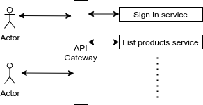

# BestCommerce Case

## Scope
- Sign in
- List products

## Services
- Sign in service
  - Spring Boot
  - H2 in memory db
- List products service
  - Spring Boot
  - H2 in memory db
- API Gateway
  - Spring Boot

## Basic flow
- All requests are routed through API Gateway.
- JWT is created by API Gateway after `sign in` request.
- JWT is validated by API Gateway.
- User should sign in and read JWT from reponse header.
- Then, user should add JWT to the header of the requests.

## Notes
- For this MVP there is no need to introduce Message Queues since current features don't require event driven architecture. It can be added later on if required.
- Each service has its own db.
- Each service can be deployable different docker image since they don't depend each other.
- In the case of docker images port details should consider `application.properties` and `application.yml` files.

## Points to further development
- Service registery can be added. Each service should add itself to the service registery and then api gateway routes request according the list fetched from service registery.
- Advanced authentication and authorization service can be used (Keycloak).
